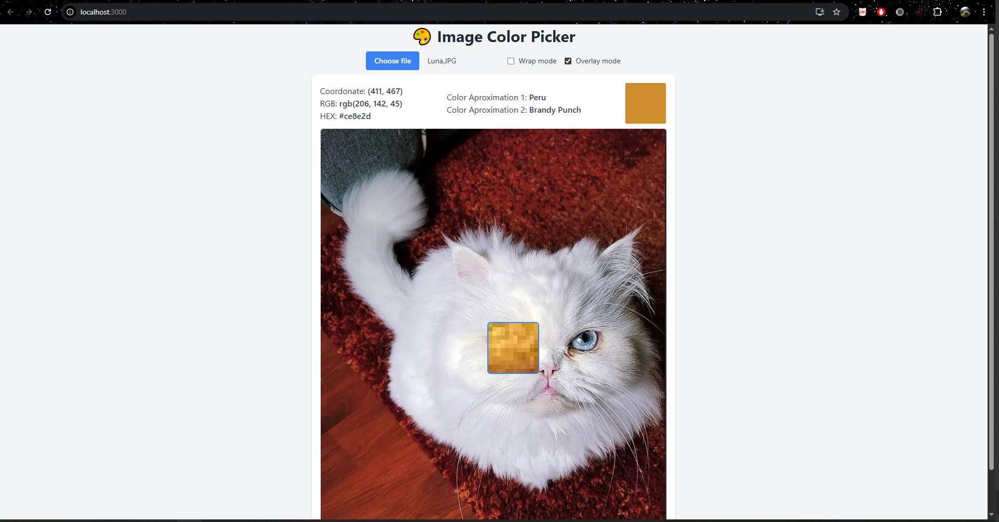
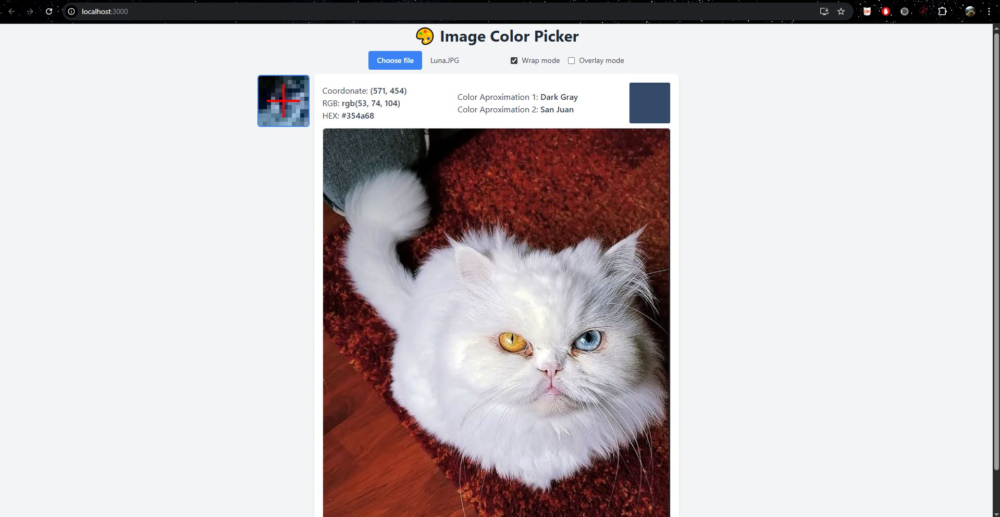

# Image Color Picker

This is a React-based web application that allows users to upload an image and inspect the color of any pixel in that image. The application provides a real-time zoomed view of the area around the cursor and displays detailed color information including RGB, HEX, and name approximations.

---

## Features

- **Image Uploading**: Upload any image from your local device.
- **Pixel Color Inspection**: Hover over the image to get color details of the specific pixel under the cursor.
- **Zoomed-In View**: A magnified preview (zoom lens) of the hovered area is shown for more precise color picking.
- **Color Naming**: Displays two approximations for the color name:
  - A custom Euclidean distance matcher from a curated color list.
  - A name derived from the `color-namer` library.
- **Interaction Modes**:
  - `wrap` mode: Zoom stays fixed to the left of the canvas.
  - `overlay` mode: Zoom follows the cursor directly over the image.

---

## How It Works

### Image Rendering

When a user uploads an image:

- It is displayed using an invisible `` element (`imgRef`).
- The image is then drawn on a `<canvas>` (`canvasRef`) using the `drawImageOnCanvas()` function.

### Mouse Movement Detection

When the mouse moves over the canvas:

1. The cursor's position relative to the canvas is calculated, factoring in scaling.
2. The image pixel data at that position is extracted using `getImageData()`.
3. RGB and HEX values are computed from the pixel data.
4. Two approximated color names are calculated:
   - `getClosestColorName()`: Matches the closest color from a large predefined list using Euclidean distance in RGB space.
   - `color-namer`: Uses a third-party library to match the color name from a standard palette.

### Zoomed Canvas

A second canvas (`zoomCanvasRef`) acts as a zoom lens:

- A small area (e.g., 12x12 pixels) around the cursor is extracted.
- This area is rendered at a much larger scale for clarity.
- A red crosshair is drawn at the center in `wrap` mode to indicate the focused pixel.

In `overlay` mode:

- The zoom canvas follows the mouse.
- It is positioned exactly over the image and moves with the cursor.

---

## Technologies Used

- **React**: For building the interactive UI.
- **HTML5 Canvas**: For rendering the image and accessing pixel-level data.
- **Tailwind CSS**: For styling the UI quickly and responsively.
- **color-namer**: A library that approximates human-friendly color names.

---

## File Structure

- `App.js`: Main application file containing all core logic and UI.
- `colorList`: A large predefined list of known RGB values with names for custom color matching.
- `README.md`: Project documentation (this file).

---

## Usage

1. Launch the app in your browser.
2. Click “Choose file” to upload an image.
3. Hover over the image to view:
   - RGB values
   - HEX code
   - Closest color name
   - Zoomed view of the area
4. Switch between `wrap` and `overlay` modes to change zoom behavior.
